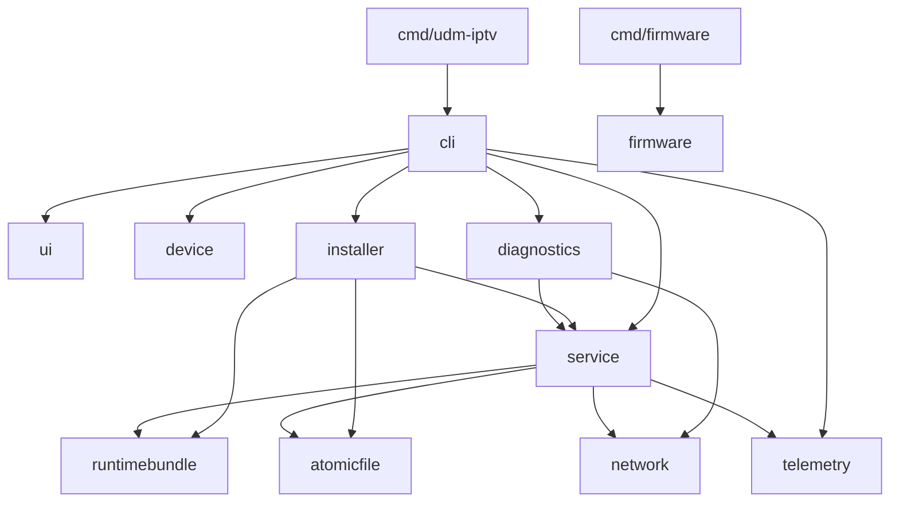

# Package ownership

Status: implemented locally; review pending.

## Decision

Commands orchestrate; domain packages own execution and tests.

Configuration types are shared across these packages.

| Package         | Owns                                                                 |
| --------------- | -------------------------------------------------------------------- |
| `cli`           | Commands, flags, dependency wiring, invocation reporting             |
| `ui`            | Forms, review screens, capture viewer                                |
| `device`        | Hardware, interface discovery, local routing hints                   |
| `config`        | Profiles, validation, persistence, legacy import                     |
| `installer`     | Installation plans, system changes, upgrades, rollback, removal      |
| `service`       | Proxy supervision, readiness, systemd jobs, runtime observations     |
| `diagnostics`   | Snapshots, captures, journal collection, rendering                   |
| `network`       | Interfaces, leases, routing, NAT                                     |
| `telemetry`     | Reporting policy, transport, identity, configuration history         |
| `runtimebundle` | Offline proxy binaries and shared libraries                          |
| `atomicfile`    | Temporary-file writes and executable replacement                     |
| `firmware`      | Firmware catalog, extraction, image builds, publication verification |

## Context

The former `app` package mixed commands with domain implementation.

## Consequences

- Tests live beside the behavior they verify.
- Domain packages cannot import command or UI packages.
- CLI callbacks connect completion generation and operational reporting.
- More explicit APIs replace implicit cross-file access.
- Runtime behavior and configuration formats remain unchanged.

## Alternatives

- File renames alone retain the original coupling.
- One package per command duplicates shared service behavior.
- A generic utilities package obscures responsibility again.

## Verification

`internal/cli/architecture_test.go` checks package dependency boundaries.

Unit tests do not replace firmware lifecycle testing.
